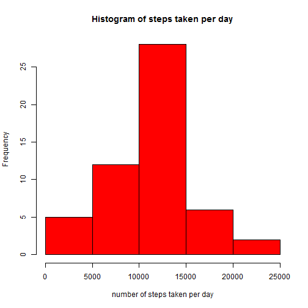
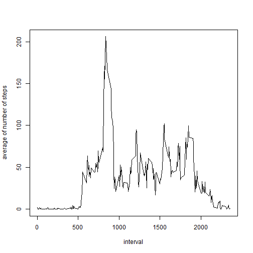
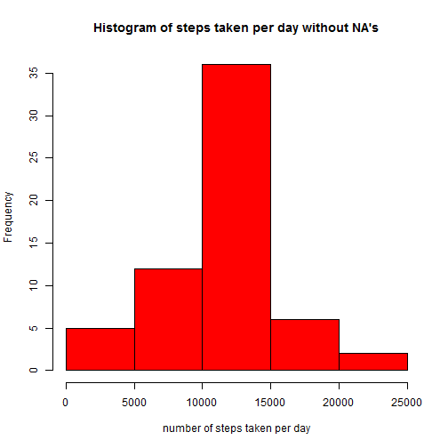

# Reproducible Research: Peer Assessment1

## Loading and preprocessing the data
Read the data from the file *"activity.csv"*

```r
Data<-read.csv("activity.csv")
```
Chage the laguage to english

```r
 Sys.setlocale("LC_TIME","English")
```

```
## [1] "English_United States.1252"
```

Select the steps from the Data and transform as numeric value

```r
steps<-as.numeric(as.character(Data[,1]))
```
Select the date from Data and transform as Date value.

```r
date<-as.Date(Data[,2],"%Y-%m-%d")
```
Select the interval from Data and transform as numeric value

```r
interval<-as.numeric(as.character(Data[,3]))
```


## What is mean total number of steps taken per day?

Create a frame with the values of steps and date.

```r
datastepsdate<-data.frame(steps,date)
```

Combine the datastepsdate frame per day

```r
library(plyr)
stepsday<-ddply(datastepsdate,.(date),summarize,stepsperday=sum(steps))
```

Plot the histogram of the total number of steps taken each day.

```r
hist(stepsday$stepsperday, col="red",xlab="number of steps taken per day", main="Histogram of steps taken per day")
```

 

Calculate the **mean**  and **median** total number of the steps taken per day

```r
meanandmedian<-ddply(datastepsdate,.(date),summarize,mean=mean(steps,na.rm=TRUE),median=median(steps, na.rm=TRUE))
print(meanandmedian)
```

```
##          date    mean median
## 1  2012-10-01     NaN     NA
## 2  2012-10-02  0.4375      0
## 3  2012-10-03 39.4167      0
## 4  2012-10-04 42.0694      0
## 5  2012-10-05 46.1597      0
## 6  2012-10-06 53.5417      0
## 7  2012-10-07 38.2465      0
## 8  2012-10-08     NaN     NA
## 9  2012-10-09 44.4826      0
## 10 2012-10-10 34.3750      0
## 11 2012-10-11 35.7778      0
## 12 2012-10-12 60.3542      0
## 13 2012-10-13 43.1458      0
## 14 2012-10-14 52.4236      0
## 15 2012-10-15 35.2049      0
## 16 2012-10-16 52.3750      0
## 17 2012-10-17 46.7083      0
## 18 2012-10-18 34.9167      0
## 19 2012-10-19 41.0729      0
## 20 2012-10-20 36.0938      0
## 21 2012-10-21 30.6285      0
## 22 2012-10-22 46.7361      0
## 23 2012-10-23 30.9653      0
## 24 2012-10-24 29.0104      0
## 25 2012-10-25  8.6528      0
## 26 2012-10-26 23.5347      0
## 27 2012-10-27 35.1354      0
## 28 2012-10-28 39.7847      0
## 29 2012-10-29 17.4236      0
## 30 2012-10-30 34.0938      0
## 31 2012-10-31 53.5208      0
## 32 2012-11-01     NaN     NA
## 33 2012-11-02 36.8056      0
## 34 2012-11-03 36.7049      0
## 35 2012-11-04     NaN     NA
## 36 2012-11-05 36.2465      0
## 37 2012-11-06 28.9375      0
## 38 2012-11-07 44.7326      0
## 39 2012-11-08 11.1771      0
## 40 2012-11-09     NaN     NA
## 41 2012-11-10     NaN     NA
## 42 2012-11-11 43.7778      0
## 43 2012-11-12 37.3785      0
## 44 2012-11-13 25.4722      0
## 45 2012-11-14     NaN     NA
## 46 2012-11-15  0.1424      0
## 47 2012-11-16 18.8924      0
## 48 2012-11-17 49.7882      0
## 49 2012-11-18 52.4653      0
## 50 2012-11-19 30.6979      0
## 51 2012-11-20 15.5278      0
## 52 2012-11-21 44.3993      0
## 53 2012-11-22 70.9271      0
## 54 2012-11-23 73.5903      0
## 55 2012-11-24 50.2708      0
## 56 2012-11-25 41.0903      0
## 57 2012-11-26 38.7569      0
## 58 2012-11-27 47.3819      0
## 59 2012-11-28 35.3576      0
## 60 2012-11-29 24.4688      0
## 61 2012-11-30     NaN     NA
```

## What is the average daily activity pattern?

Create a frame with the values of steps and interval.

```r
stepsinterval<-data.frame(steps, interval)
```

Combine the stepsinterval frame per interval.

```r
stepsperinterval<-ddply(stepsinterval,.(interval),summarize,stepsperinterval=mean(steps,na.rm=TRUE))
```

1. Plot the 5-minute interval and the average number of steps taken, averaged across all days.


```r
plot(stepsperinterval, type="l", ylab="average of steps taken across all days")
```

 

Obtain the maximum number of steps.

```r
maxsteps<-max(steps, na.rm=TRUE)
```
Find the location of the interval with the step maximum.

```r
locationmaxstep<-stepsinterval[stepsinterval$steps %in% c(maxsteps),]
```

2. The 5-minute interval, on average across all the days in the dataset, contains the maximum number of steps is:

```r
locationmaxstep[[2]]
```

```
## [1] 615
```


## Imputing missing values

1. The total number of missing values in the dataset.

```r
stepsinf<-summary(steps)
stepsinf[["NA's"]]
```

```
## [1] 2304
```

2. For filling in all of the missing values in the dataset. We are going to use the mean/median for that day, or the mean for that 5-minute interval.


```r
Newsteps<-steps
for(i in 1:length(steps)){
        sp<-steps[i]
        if(is.na(sp)){
                day<-date[i]
                MM<-meanandmedian[meanandmedian$date %in% c(day),] ## give the value of mean and median
                                                                   ## for the specific day
                Mean<-MM[["mean"]]
                Median<-MM[["median"]]
                if(is.na(Mean)){
                        if(is.na(Median)){
                                Int<-interval[i]
                                IS<-stepsperinterval[stepsperinterval$interval %in% c(Int),] ##give the value of
                                                                                             ## average of interval
                                stp<-IS[["stepsperinterval"]]
                                }
                        if (!is.na(Median)){
                                stp<-Median
                                }
                        Newsteps[i]<-stp
                        }
                if(!is.na(Mean)){
                        Newsteps[i]<-Mean
                        }
         }
        if (!is.na(sp)){
                Newsteps[i]<-steps[i]
        }
}
```
3. New dataset that is equal to the original dataset but with the missing data filled in


```r
Newdata<-data.frame(Newsteps,date,interval)
```

4. a. Histogram of the total number of steps taken each day

```r
stepsdaynewdata<-ddply(Newdata,.(date),summarize,totalstepsperday=sum(Newsteps))
hist(stepsdaynewdata$totalstepsperday, col="red",,xlab="number of steps taken per day", main="Histogram of steps taken per day without NA's")
```

 
   
   b. Calculate the **mean** and **median** total number of steps taken per day. 

```r
Newdatameanmedian<-ddply(Newdata,.(date),summarize,mean=mean(Newsteps),median=median(Newsteps))
print(Newdatameanmedian)
```

```
##          date    mean median
## 1  2012-10-01 37.3826  34.11
## 2  2012-10-02  0.4375   0.00
## 3  2012-10-03 39.4167   0.00
## 4  2012-10-04 42.0694   0.00
## 5  2012-10-05 46.1597   0.00
## 6  2012-10-06 53.5417   0.00
## 7  2012-10-07 38.2465   0.00
## 8  2012-10-08 37.3826  34.11
## 9  2012-10-09 44.4826   0.00
## 10 2012-10-10 34.3750   0.00
## 11 2012-10-11 35.7778   0.00
## 12 2012-10-12 60.3542   0.00
## 13 2012-10-13 43.1458   0.00
## 14 2012-10-14 52.4236   0.00
## 15 2012-10-15 35.2049   0.00
## 16 2012-10-16 52.3750   0.00
## 17 2012-10-17 46.7083   0.00
## 18 2012-10-18 34.9167   0.00
## 19 2012-10-19 41.0729   0.00
## 20 2012-10-20 36.0938   0.00
## 21 2012-10-21 30.6285   0.00
## 22 2012-10-22 46.7361   0.00
## 23 2012-10-23 30.9653   0.00
## 24 2012-10-24 29.0104   0.00
## 25 2012-10-25  8.6528   0.00
## 26 2012-10-26 23.5347   0.00
## 27 2012-10-27 35.1354   0.00
## 28 2012-10-28 39.7847   0.00
## 29 2012-10-29 17.4236   0.00
## 30 2012-10-30 34.0938   0.00
## 31 2012-10-31 53.5208   0.00
## 32 2012-11-01 37.3826  34.11
## 33 2012-11-02 36.8056   0.00
## 34 2012-11-03 36.7049   0.00
## 35 2012-11-04 37.3826  34.11
## 36 2012-11-05 36.2465   0.00
## 37 2012-11-06 28.9375   0.00
## 38 2012-11-07 44.7326   0.00
## 39 2012-11-08 11.1771   0.00
## 40 2012-11-09 37.3826  34.11
## 41 2012-11-10 37.3826  34.11
## 42 2012-11-11 43.7778   0.00
## 43 2012-11-12 37.3785   0.00
## 44 2012-11-13 25.4722   0.00
## 45 2012-11-14 37.3826  34.11
## 46 2012-11-15  0.1424   0.00
## 47 2012-11-16 18.8924   0.00
## 48 2012-11-17 49.7882   0.00
## 49 2012-11-18 52.4653   0.00
## 50 2012-11-19 30.6979   0.00
## 51 2012-11-20 15.5278   0.00
## 52 2012-11-21 44.3993   0.00
## 53 2012-11-22 70.9271   0.00
## 54 2012-11-23 73.5903   0.00
## 55 2012-11-24 50.2708   0.00
## 56 2012-11-25 41.0903   0.00
## 57 2012-11-26 38.7569   0.00
## 58 2012-11-27 47.3819   0.00
## 59 2012-11-28 35.3576   0.00
## 60 2012-11-29 24.4688   0.00
## 61 2012-11-30 37.3826  34.11
```
   
   c. **Do these values differ from the estimates from the first part of the assignment?**
   
*This values only differ from the estimates from the first part in the information for the missing values, because the missing values are filled in with the corresponding information mean/median or average of 5-minutes interval. The rest of information remain equal.* 

   **What is the impact of imputing missing data on the estimates of the total daily number of steps?**
      
*The impact of imputing missing data on the estimates of the total daily number of steps does not change when compared to the original the estimate of the total daily number of steps.*
           


## Are there differences in activity patterns between weekdays and weekends?

1. Create a new factor variable in the dataset with two levels - "weekday" and "weekend" indicating whether a given date is a weekday or weekend day.

```r
days<-weekdays(date)
weekdayandweekend<-days
for(i in 1:length(days)){
        day<-days[i]
        if(day=="Monday"| day=="Tuesday"| day=="Wednesday" |day=="Thursday" | day=="Friday"){
                weekdayandweekend[i]<-"weekday"
        }
        if(day=="Saturday" | day=="Sunday"){
                weekdayandweekend[i]<-"weekend"
        }
}
```
2. Create a frame with the values of steps and weekdays or weekend.

```r
DT<-data.frame(Newsteps,weekdayandweekend,interval)
```

Combine the DT frame per day

```r
FinalData<-aggregate(Newsteps ~ weekdayandweekend +interval , data = DT, mean)
```

Plot a time series of the 5-minute interval and the average number of steps taken, averaged across all weekday days or weekend days.

```r
library(lattice)
xyplot(Newsteps ~ interval |weekdayandweekend , data = FinalData, layout = c(1,2),type="l", ylab="Number of steps", xlab="Interval")
```

 
